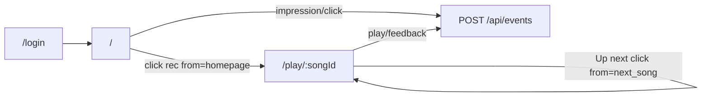
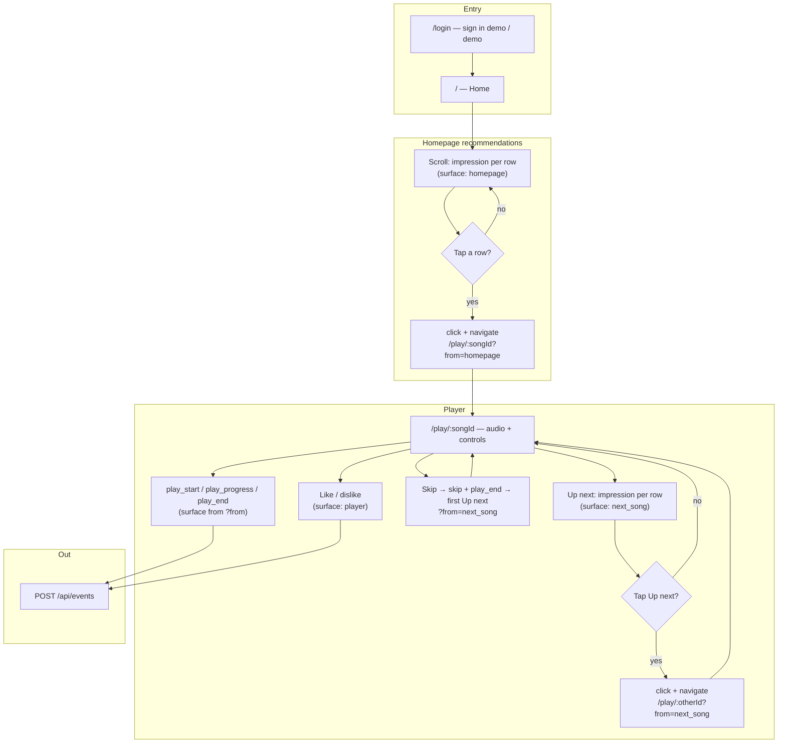
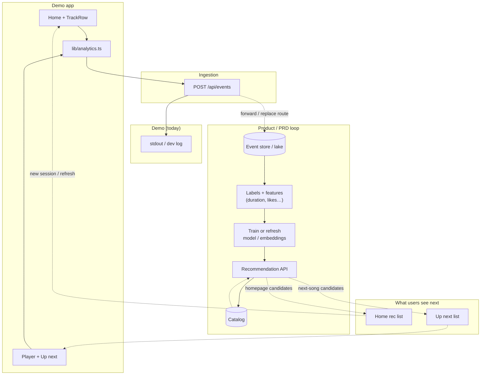

# LLD — demo streaming UI

**What:** Low-level design for this repo’s Next.js demo (routes, modules, analytics payloads, playback hooks).  
**When:** Onboarding, refactors, swapping mock data/auth, or wiring `/api/events` to a real sink.

Code paths below are relative to the **`frontend/`** app root. Product specs in the repo root: [mockup.md](../../mockup.md), [prd.md](../../prd.md).

## System context

The app is a thin **mock-auth** shell over **static catalog + deterministic “recommendations”**, with **client-emitted analytics** to `POST /api/events`. Product behavior is specified in [mockup.md](../../mockup.md); business context in [prd.md](../../prd.md).

## User journey

Chronological path for a **signed-in** user (see [mockup.md](../../mockup.md) flows). Surfaces drive **`surface`** on analytics: homepage list → `homepage`; queue list → `next_song`; explicit like/dislike → `player`.

**One-line summary:** login → browse homepage recs (impressions) → open player from home → listen (timed events) → scan and pick from Up next (next-song impressions/clicks) or Skip → optional explicit feedback — all steps emit events to the same API.

## Feedback loop

**Demo today:** the client always sends structured events to `POST /api/events`; the route validates and **logs** them (see [app/api/events/route.ts](../app/api/events/route.ts)). There is **no** closed loop back into `getHomeRecommendations` / `getNextSongs` yet — catalog recs stay deterministic.

**Product shape (PRD §12):** the same event stream is what would feed storage, training, and refreshed recommendations. The diagram below shows both the **current wiring** (solid) and the **intended loop** (dashed).

**How to read it:** every meaningful action in the user journey produces **observations** (`impression` → `click` → `play_*` / `skip` → `like`/`dislike`). In production those observations accumulate; offline jobs turn them into **training signals**; a **serving layer** combines catalog + model outputs so the **next** homepage load and **next** queue refresh reflect updated personalization. The demo implements the left-hand path through `emitEvent` → API; wiring `STORE` → `TRAIN` → `SVC` and swapping [lib/mock/catalog.ts](../lib/mock/catalog.ts) for API-backed lists is described under **Extension hooks**.

## Route map

| Path | File | Auth | Notes |
|------|------|------|--------|
| `/login` | [app/login/page.tsx](../app/login/page.tsx) | Public; redirects to `/` if cookie present | Renders [components/LoginForm.tsx](../components/LoginForm.tsx); posts to `/api/auth/login` |
| `/` | [app/page.tsx](../app/page.tsx) | Required | Server loads session, builds deduped home rec list, renders [components/HomeContent.tsx](../components/HomeContent.tsx) |
| `/play/[songId]` | [app/play/[songId]/page.tsx](../app/play/[songId]/page.tsx) | Required | Resolves `from` query (`homepage` \| `next_song`), renders [components/PlayerView.tsx](../components/PlayerView.tsx) |
| `POST /api/auth/login` | [app/api/auth/login/route.ts](../app/api/auth/login/route.ts) | Public | Sets HTTP-only `demo_session` cookie (`SESSION_COOKIE` in [lib/constants.ts](../lib/constants.ts)) |
| `POST /api/auth/logout` | [app/api/auth/logout/route.ts](../app/api/auth/logout/route.ts) | Public | Clears session cookie |
| `POST /api/events` | [app/api/events/route.ts](../app/api/events/route.ts) | Public | Validates minimal event shape; **dev:** `console.log` each event |

**Middleware:** [middleware.ts](../middleware.ts) — redirects unauthenticated users away from `/` and `/play/*` to `/login`; redirects authenticated users away from `/login` to `/`.

## Module map

| Area | Responsibility |
|------|----------------|
| [lib/constants.ts](../lib/constants.ts) | `SESSION_COOKIE`, `SURFACE`, `EVENT_TYPE` string constants |
| [lib/types.ts](../lib/types.ts) | `Song`, `AnalyticsEvent`, `PlaySurface`, etc. |
| [lib/auth.ts](../lib/auth.ts) | Server-only `getSession()` via `cookies()` |
| [lib/analytics.ts](../lib/analytics.ts) | Client-only: `emitEvent`, session id in `sessionStorage`, helpers for play/skip/like |
| [lib/format.ts](../lib/format.ts) | `formatMmSs` for UI |
| [lib/mock/catalog.ts](../lib/mock/catalog.ts) | `CATALOG`, `getSongById`, `getHomeRecommendations`, `getNextSongs`, `dedupeBySongId` |
| [lib/hooks/useInViewOnce.ts](../lib/hooks/useInViewOnce.ts) | `IntersectionObserver` fires once per row mount |
| [components/TrackRow.tsx](../components/TrackRow.tsx) | Row UI + viewport **impression** |
| [components/TrackList.tsx](../components/TrackList.tsx) | Maps rows; **click** + `router.push` to `/play/:id?from=...` |
| [components/PlayerView.tsx](../components/PlayerView.tsx) | `<audio>`, transport, Skip, like/dislike, **Up next** list, play lifecycle analytics |
| [components/SearchBarDecor.tsx](../components/SearchBarDecor.tsx) | Read-only search chrome (no search feature) |
| [app/globals.css](../app/globals.css) + [app/layout.tsx](../app/layout.tsx) | “Concert venue” palette, Geist + Fraunces (`font-display` utility) |

Imports stay shallow: pages → feature components → `lib/*`.

## Data and session

- **Catalog** is a static array in [lib/mock/catalog.ts](../lib/mock/catalog.ts); each `Song` includes `title`, `genre`, `author`, `singer`, `audio_url` (SoundHelix demos), and `artwork_url` (picsum; allowed in [next.config.ts](../next.config.ts)).
- **Home order** is deterministic from `userId` + `song_id` hash; the list intentionally includes a duplicate first row before **client dedupe** in [app/page.tsx](../app/page.tsx).
- **Next songs** are “other catalog tracks” in stable slice order (`getNextSongs`).
- **Session** is JSON in cookie `demo_session`: `{ "userId", "username" }` (username is the value used at sign-in, shown next to Logout), parsed in [lib/auth.ts](../lib/auth.ts). Login accepts **demo** / **demo** ([app/api/auth/login/route.ts](../app/api/auth/login/route.ts)).

## Analytics contract (`POST /api/events`)

Server accepts a single JSON object or `{ events: [...] }`; each event must include at least: `user_id`, `song_id`, `timestamp`, `surface`, `event_type`, `session_id` ([app/api/events/route.ts](../app/api/events/route.ts)).

| `event_type` | When | `surface` | Key fields |
|--------------|------|-----------|------------|
| `impression` | Row enters viewport (threshold ~0.35) | `homepage` or `next_song` | `position`, optional `request_id` |
| `click` | User chooses a row to play | same as list | `position`, `request_id` |
| `play_start` | Audio `playing` first time for this track | **`homepage` or `next_song`** (from URL `?from=`) | — |
| `play_progress` | Throttled ~10s while playing | same as play | `play_duration_seconds`, `song_duration_seconds` |
| `play_end` | Pause, ended, tab hide/close handlers, after Skip | same as play | `play_duration_seconds`, `song_duration_seconds`, `completed` when natural end |
| `skip` | User taps Skip | same as play | durations at skip time |
| `like` / `dislike` | Buttons on player | **`player`** | `song_id` |

**Play origin surface:** [app/play/[songId]/page.tsx](../app/play/[songId]/page.tsx) sets `playSurface` from `from` (`next_song` only if query says so; else `homepage`). [components/TrackList.tsx](../components/TrackList.tsx) sets `from` when navigating.

## Playback and lifecycle ([components/PlayerView.tsx](../components/PlayerView.tsx))

- **`<audio>`** is hidden; `key` behavior is remount via navigation when `songId` changes.
- **`play_start`:** once per track after `playing`, gated by `playStartSent` ref reset on `song_id` change.
- **`play_progress`:** derived from `timeupdate` with a 10s wall-clock throttle (`lastProgressEmit`).
- **`play_end`:** natural `ended` (completed); user **Pause** (toggle sends end then pause); **visibilitychange** + **beforeunload** flush partial listen (may overlap in edge cases—acceptable for demo).
- **Skip:** `emitSkip` + `emitPlayEnd`, then `router.push` to first **Up next** id with `?from=next_song`.

## Impressions

- [lib/hooks/useInViewOnce.ts](../lib/hooks/useInViewOnce.ts) attaches one `IntersectionObserver` per row; fires at most once per mount (`fired` ref).
- **Position** is 0-based index in the rendered list after home dedupe.

## Extension hooks

1. **Real recommendation API** — Replace [lib/mock/catalog.ts](../lib/mock/catalog.ts) calls in [app/page.tsx](../app/page.tsx) and [app/play/[songId]/page.tsx](../app/play/[songId]/page.tsx); keep `Song` shape or adapt mapping in one place.
2. **Persist queue** — Today, queue is recomputed from `getNextSongs(currentSongId)`; add React state/context or URL state in `PlayerView` if you need a stable editable queue.
3. **Analytics sink** — Change [app/api/events/route.ts](../app/api/events/route.ts) to forward to Kafka/HTTP; client stays on [lib/analytics.ts](../lib/analytics.ts).
4. **Real auth** — Swap `/api/auth/*` and [middleware.ts](../middleware.ts) checks; keep passing `userId` into client sections via server components.

## Non-goals

See [mockup.md](../../mockup.md) (search, billing UI, production analytics SDKs, etc.). This LLD does not restate [prd.md](../../prd.md) product goals.
